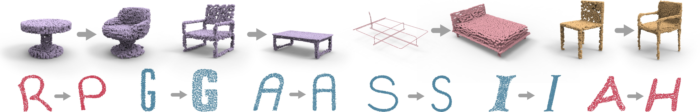

### <a href="https://kangxue.org/logan.html"> LOGAN: *Unpaired Shape Transform in Latent Overcomplete Space*</a>

<a href="http://kangxue.org">Kangxue Yin</a>, <a href="https://czq142857.github.io/">Zhiqin Chen</a>, <a href="http://vcc.szu.edu.cn/~huihuang/">Hui Huang</a>, <a href="http://www.cs.tau.ac.il/~dcor/">Daniel Cohen-Or</a>, <a href="https://www.cs.sfu.ca/~haoz/">Hao Zhang</a>. <br/>

[<a href="https://arxiv.org/pdf/1903.10170.pdf">Paper</a>] [<a href="https://kangxue.org/papers/logan_supp.pdf">Supplementary material</a>]





### Prerequisites

- Linux (tested under Ubuntu 16.04 )
- Python (tested under 3.5.4)
- TensorFlow (tested under 1.12.0-GPU )
- numpy, scipy, etc.

The code is built on the top of 
<a href="https://github.com/optas/latent_3d_points">latent_3d_points</a> and
<a href="https://github.com/charlesq34/pointnet2">pointnet2</a>.  Before run the code, please compile the customized TensorFlow operators under the folders "latent\_3d\_points/structural\_losses" and 
"pointnet\_plusplus/tf\_ops".

### Dataset

- Download the dataset <a href="https://www.dropbox.com/s/t7jqdvbiqf0t2um/logan_data.zip?dl=1">HERE</a>.
- If you are in China, you can choose to download it from <a href="https://share.weiyun.com/5WbWcaw"> HERE</a>.


### Usage

An example of training and testing the autoencoder:
```
python -u run_ae.py  --mode=train   --class_name_A=chair    --class_name_B=table    --gpu=0
python -u run_ae.py  --mode=test    --class_name_A=chair    --class_name_B=table    --gpu=0   --load_pre_trained_ae=1
```

Training and testing the translator:
```
python -u run_translator.py  --mode=train  --class_name_A=chair    --class_name_B=table   --gpu=0
python -u run_translator.py  --mode=test   --class_name_A=chair    --class_name_B=table   --gpu=0   --load_pre_trained_gan=1
```

Upsampling:
```
Hmm.. I haven't got enough time to put this into the release version of the code. I will work on it as soon as I get time. 
```
Please note that all the quantitative evaluation results we provided in the paper were done with point clouds of size 2048, i.e., before upsampling.


### Citation
If you find our work useful in your research, please consider citing:

    @article {yin2019logan,
        author = {Kangxue Yin and Zhiqin Chen and Hui Huang and Daniel Cohen-Or and Hao Zhang}
        title = {LOGAN: Unpaired Shape Transform in Latent Overcomplete Space}
        journal = {ACM Transactions on Graphics(Special Issue of SIGGRAPH Asia)}
        volume = {38}
        number = {6}
        pages = {198:1--198:13}
        year = {2019}
    }


### Acknowledgments
The code is built on the top of
<a href="https://github.com/optas/latent_3d_points">latent_3d_points</a> and
<a href="https://github.com/charlesq34/pointnet2">pointnet2</a>. Thanks for the precedent contributions.

